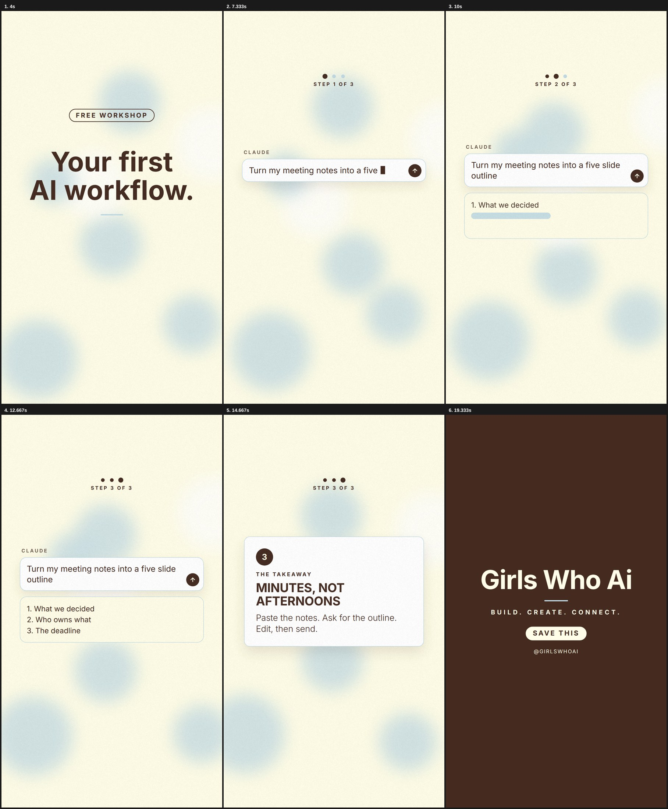

# gwai-motion

A Claude Code skill that makes Girls Who Ai videos in code. Soft blue, vanilla cream and brown. Helvetica. The GWAI voice. Every film ends on the lockup: Girls Who Ai, the soft blue rule, BUILD. CREATE. CONNECT.

Send it a few photos, a screenshot of a chat, a flyer or just the event details, and it makes a Reel, a TikTok, a story or a square post. It renders with HyperFrames (HTML to video, Apache 2.0) and remembers your choices for the next film.



## Three styles

**Showreel.** Fast. Lit Three.js scenes, a cut every two beats, giant capitals slammed on a trap beat, colour flips between brown, blue and cream. For hackathons, cohort launches, challenges and big news.

**Soft.** Calm and editorial. Cream paper, drifting soft blue light, lines that rise gently, photos arriving as cards, a lo-fi bed. For announcements, recaps, member spotlights, quotes and "send this to her".

**Lesson.** A friend showing you how. Progress dots, numbered steps, a prompt box that types, presses send and gets its answer, a takeaway card. For AI tips, prompts, tools and workflows.

## Video types

Event or hackathon. Cohort or course launch. AI tip or tool tutorial. Challenge. Event recap. Member spotlight. Send this to her. Deadline or last call. Quote or stat. Each has its own chapters and ending (`reference/video-types.md`), and every fact on screen comes from you word for word.

## Install

In Claude Code:

```
/plugin marketplace add hibatouati/Video-Motion-Skill
/plugin install gwai-motion@gwai-motion-skill
```

Or copy the skill folder by hand:

```bash
git clone https://github.com/hibatouati/Video-Motion-Skill
mkdir -p ~/.claude/skills
cp -R Video-Motion-Skill/plugins/gwai-motion/skills/gwai-motion ~/.claude/skills/
```

Optional: the official HyperFrames skills this one builds on (`npx hyperframes skills update`).

## Use

Ask Claude Code for the film:

> Make a 15 second Reel for the Beauty Decoded hackathon. Here's the flyer.

> Turn these 6 photos from last night into a recap.

> Make a lesson video: how to turn meeting notes into a slide outline with Claude. Here's my prompt and the answer.

> Make a "send this to her" video for the September cohort.

It asks a few questions (type, style, format, the facts it needs, music), each with a "You choose for me" option. Then it builds, shows you three style frames, reviews its own stills, renders and checks the final file.

## What's inside

```
plugins/gwai-motion/skills/gwai-motion/
├── SKILL.md              workflow, rules, quality floor, traps
├── reference/            gwai-brand, styles, video-types, interview, discovery, story,
│                         showreel, ingredients, engine, assets, music, review, render, social
├── templates/
│   ├── BRAND.md          the GWAI profile (copied to videos/BRAND.md, updated after every film)
│   ├── film-prompt.md    the film brief
│   ├── index.html        showreel starter (lit 3D, HUD, slams, lockup)
│   ├── index-soft.html   soft and lesson starter (cream, soft light, prompt box, progress, lockup)
│   ├── cues.js           the beat sheet
│   └── kit/              film, motion, words, draw, cursor, fx, three, debug,
│                         gwai (pill, badge, rule, card, prompt box, progress, soft light, lockup)
└── scripts/
    ├── setup.mjs         create the project for a style, vendor GSAP, Three.js and the font
    ├── synth.py          royalty-free beds (trap, lo-fi, punchy, soft) and effects (incl. type, send)
    ├── beats.py          beat grid from a song
    ├── audio-edit.py     cut a song on bars
    ├── place-audio.mjs   write the audio tags from the beat sheet
    ├── beat-sheet.mjs    the readable beat sheet, with a dead-bar check
    ├── stills.mjs        review stills by bar and beat
    ├── render.mjs        master, motion blur, deliverables
    ├── verify.py         decode the files and check them
    └── cues-lib.mjs      shared: read cues.js in Node
```

## Requirements

Claude Code. Node.js 22 or newer and FFmpeg (HyperFrames needs both; `npx hyperframes doctor` checks). `uv` for the Python scripts.

## Font

Helvetica is the brand face. Films ship Inter (OFL) as the stand-in so every render looks the same on any machine. If you have licensed Helvetica files, drop them in the film's `assets/fonts/` and point the `@font-face` at them.

## License

MIT. See LICENSE. Built on [brand-motion-design](https://github.com/ouerf-man/brand-motion-design-skill) by Raed Ouerfelli (MIT), itself based on product-film by Anthony Riera (MIT).
